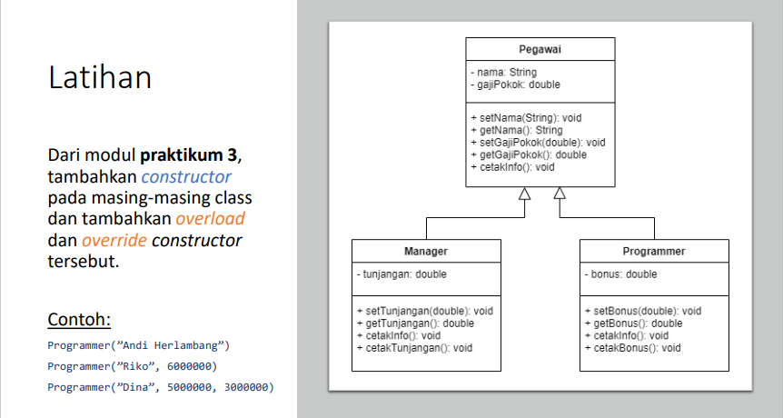
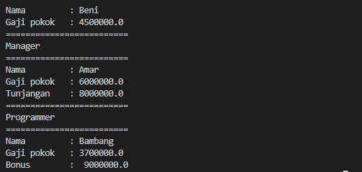

# Tugas Pertemuan 5
## Pemrograman Orientasi Objek

```sh
Nama   : Raihan Tantowi
Nim    : 312110229
Matkul : Pemrograman Orientasi Objek
```



#### A. File Pegawai.java
* **Class Pegawai :**
```java
public class Pegawai{
    String nama;
    double gajipokok;

    public Pegawai(String nama, double gajipokok){
        this.nama = nama;
        this.gajipokok = gajipokok;
    }

    public void cetakInfo(){
        System.out.println("=========================");
        System.out.println("Nama         : " + this.nama);
        System.out.println("Gaji pokok   : " + this.gajipokok);
    }
}
```

#### B. File Manager.java
* **Class Manager:**
```java
public class Manager extends Pegawai {
    double tunjangan;

    public Manager(String nama, double gajipokok, double tunjangan){
        super(nama, gajipokok);
        this.tunjangan = tunjangan;
    }

    public void cetakInfo(){
        System.out.println("=========================");
        System.out.println("Manager");
        super.cetakInfo();
        System.out.println("Tunjangan    : " + this.tunjangan);
        System.out.println("=========================");
    }
}
```

#### C. File Programmer.java
* **Class Programmer:**
```java
public class Programmer extends Pegawai{
    double bonus;
    
    public Programmer(String nama, double gajipokok, double bonus){
        super(nama, gajipokok);
        this.bonus=bonus;

    }

    public void cetakInfo(){
        System.out.println("Programmer");
        super.cetakInfo();
        System.out.println("Bonus        :  "+ this.bonus);
    }
}
```

#### D. File PegawaiBeraksi.java
* **Class PegawaiBeraksi (Main):**
```java
public class PegawaiBeraksi {
    public static void main(String[] args){
        // Membuat objek dan beri nilai
        Pegawai Beni = new Pegawai("Beni", 4500000);
        Manager Amar = new Manager ("Amar", 6000000, 8000000);
        Programmer Bambang = new Programmer ("Bambang", 3700000, 9000000);

        // Memanggil atribut
        Beni.cetakInfo();
        Amar.cetakInfo();
        Bambang.cetakInfo();
    }
}
```

* **Hasil output program:**


